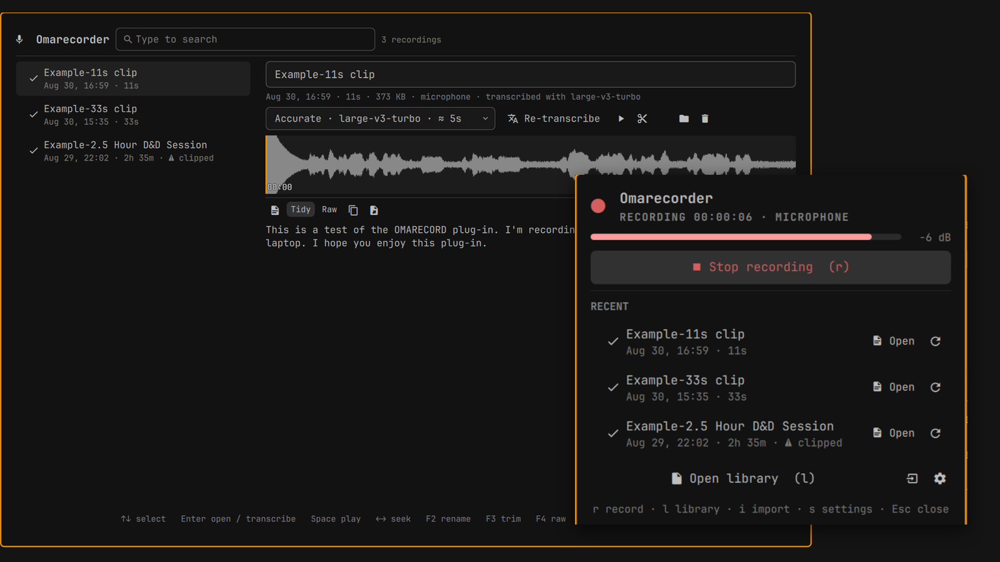

# OmaRecorder

Record conversations and meetings from the Omarchy bar, keep the audio, and
transcribe it locally, later, with the voxtype/whisper engine Omarchy already
ships. One click to record, a library to browse, a transcript beside every
recording, and a note in Obsidian when you want one. Nothing leaves your machine.



## About this project

OmaRecorder was built with AI assistance (Claude Code) by a hobbyist, not a
professional developer. Every effort was made to follow good practice anyway:
the code is reviewed by a second model on each pull request, every CLI
behaviour has a test, the security posture was audited and fixed before release,
and every claim in this README was checked against the code. Please read the
source with that in mind, and if you know better, open an issue or a pull
request. Contributions from people who do this for a living are very welcome.
See [CONTRIBUTING.md](CONTRIBUTING.md) for the principles the project follows
and a "help wanted" list: languages other than English, UI improvements that
keep it simple, accessibility, other hardware.

This is a part-time project. Issues and pull requests are read and handled as
time allows, not on a schedule. If you need something sooner, fork it and make
it your own; the MIT license is there for exactly that.

If you are on macOS or Windows, go look at
[Samurai Scribe](https://samuraiscribe.com/) instead: a polished, far more
feature-rich local transcription app whose "record, keep, transcribe, browse"
shape inspired this plugin. To be clear, its developer had no discussion with
or input into OmaRecorder; the inspiration was entirely from admiring their
work. OmaRecorder exists because nothing like it fit an Omarchy desktop.

## Privacy and security

Local first is the rule, not a feature. Everything in 1.0 runs on your machine:

* Audio and transcripts stay on disk. Transcription runs on your CPU or GPU via
  voxtype. The only network activity is voxtype's model download, and only when
  you ask for a model you do not have.
* Everything the plugin writes is private to your user: `umask 077`, so
  recordings, transcripts, notes, config and state are `0600` files in `0700`
  folders.
* Runtime state (pids, jobs, the live level) lives only in
  `$XDG_RUNTIME_DIR/omarecorder/` (`0700`). It never falls back to `/tmp`; with
  no runtime directory the CLI stops instead.
* Titles, paths and ids are data. They travel as arguments and `jq --arg`, never
  inside a shell string, a `jq` filter or a unit body. whisper's stderr (which
  can echo decoded text) goes to a per-job file, not the shared log.
* It does not edit your Hyprland, Omarchy or Obsidian configuration (Obsidian's
  `obsidian.json` and `app.json` are only read), does not delete anything
  outside a recording folder, never `rm -rf`s a recording without
  `--permanent`, runs no daemon, polls nothing, and uploads nothing.

**Local only, by design.** OmaRecorder does everything with tools that ship
with Omarchy and sends nothing anywhere. That includes the transcript
clean-up: the Tidy pass that breaks the text into paragraphs and removes
repeated passages is a deterministic script, not a language model. This
plugin will not call an AI service, hosted or otherwise, and no such feature
is planned for it.

The author does use AI to polish transcripts further, but does so inside the
Obsidian vault after Send to Obsidian, with the tools of his choosing. That
step is a personal workflow outside this plugin, and it stays outside so that
the plugin's privacy statement remains simple and true.

Should there be real demand for AI-assisted clean-up, the author is open to
revisiting this decision, most likely as a separate, clearly labelled edition
rather than a change to this one. Open an issue if that matters to you.

## Prior art and thanks

* [Samurai Scribe](https://samuraiscribe.com/), a local transcription app for
  macOS and Windows. Its "record, keep, transcribe, browse" idea inspired this
  plugin, from a distance: its developer had no involvement in OmaRecorder and
  deserves none of the blame for it. If you are on either platform, use Samurai
  Scribe; it is far more polished than this.
* [voxtype](https://github.com/peteonrails/voxtype), the push-to-talk dictation
  engine Omarchy ships. OmaRecorder is a library around its `transcribe` command.
* [omarchy-voxtype-osd](https://github.com/rmacy/omarchy-voxtype-osd) for the
  level meter ideas.
* [omarchy-voxtype-enhance](https://github.com/iamcheyan/omarchy-voxtype-enhance)
  for the model download cards.
* [omarchy-todoist](https://github.com/Aryan-Techie/omarchy-todoist) and
  [omarchy-github](https://github.com/robzolkos/omarchy-github) for the panel
  and manifest conventions.
* [syncshell](https://github.com/ilyaZar/syncshell) (omarchy-syncthing) for the
  service and panel split and its test suite.
* [anarlog](https://anarlog.so/) for the "session library" shape.

## What it does

* **Bar widget**: record/stop with a running timer and a live input meter that
  reads CLIP when the microphone is too hot; a source picker (microphone,
  system audio, or both); recent recordings; import; settings.
* **Library overlay**: every recording with date, duration and status. Rename,
  play and scrub on the waveform, trim losslessly with the original kept,
  transcribe (Fast, Balanced or Accurate, with time estimates learned from your
  own hardware), read, copy, send to Obsidian, delete.
* **Long takes**: anything over 30 minutes is transcribed in pieces. The
  transcript fills in piece by piece, and cancelling keeps what is done.
* **CLI**: everything the UI does is `omarecorder <command>`, so keybindings,
  the Omarchy menu and your own scripts get the same behaviour.
* **Local-first, no bloat**: no daemons, no polling. Recording is `pw-record`,
  transcription is `voxtype transcribe` in a detached `systemd-run --user` unit,
  and the shell only watches a few small files.

## Requirements

Every external tool the CLI calls, with the Arch package that provides it. All
of them ship with Omarchy 4 except voxtype, which one command adds.
`omarecorder setup check` tells you what is missing.

| Tool | Package | Used for | In Omarchy 4 |
|---|---|---|---|
| `voxtype` | `omarchy install dictation` | transcription engine, model downloads | one command away |
| `pw-record`, `pw-play` | `pipewire` | recording; playback fallback | yes |
| `pactl` | `libpulse` | finding the microphone and monitor | yes (with pipewire-pulse) |
| `ffmpeg`, `ffprobe` | `ffmpeg` | import, mixing, levels, live meter, waveform, trim, chunking | yes |
| `jq` | `jq` | all state and metadata | yes |
| `systemd-run`, `systemctl`, `systemd-inhibit` | `systemd` | detached jobs, keep-awake | yes |
| `flock`, `setsid` | `util-linux` | state locking, detaching | yes |
| `mpv` | `mpv` | playback from the CLI (`pw-play` if absent) | yes |
| `wl-copy` | `wl-clipboard` | `copy` to the clipboard | yes |
| `gio` | `glib2` | `delete` moves to the trash | yes |
| `xdg-open` | `xdg-utils` | open folder, `obsidian://` links | yes |
| `omarchy-notification-send` (`notify-send` fallback), `omarchy-launch-editor`, `omarchy-shell` | Omarchy | notifications, open transcript, Library toggle | yes |
| Obsidian | `obsidian` | Send to Obsidian (optional; without it the note lands next to the recording) | yes |

Only voxtype, pw-record, pactl, ffmpeg/ffprobe and jq are required. Each of the
others switches off one feature when missing.

## Install

```bash
omarchy plugin add https://github.com/huey-holdings-llc/omarecorder --enable
```

Pick a bar section when asked, or later with
`omarchy bar move io.github.huey-holdings-llc.omarecorder --section right`.

Optional, and only needed for keybindings, the menu and scripts. The widget and
the Library call the CLI by its own path and work without this:

```bash
ln -s ~/.config/omarchy/plugins/io.github.huey-holdings-llc.omarecorder/bin/omarecorder ~/.local/bin/omarecorder
```

First run: open the popup. If a requirement is missing (no whisper model yet, a
tool not installed, no microphone), a "Setup needed" card lists each one with
the command that fixes it, and downloads the default model with one click.

## Update

```bash
omarchy plugin update io.github.huey-holdings-llc.omarecorder
```

## Remove

```bash
omarchy plugin remove io.github.huey-holdings-llc.omarecorder
rm -f ~/.local/bin/omarecorder   # if you made the symlink
```

Your recordings in `~/Recordings` and your config in `~/.config/omarecorder`
are left untouched.

## Use

* **Bar icon**: a microphone when idle. Left-click opens the popup, right-click
  starts or stops recording. While recording it becomes a red record glyph with
  a running `HH:MM:SS`, replaced by CLIP while the input is on the rails. An
  hourglass means a transcription is running.
* **Popup keys**: `r` record/stop, `l` library, `i` import, `s` settings,
  `Up`/`Down` and `Enter` on recent rows, `Esc`.
* **Library keys**: type to search. `Up`/`Down`, `PgUp`/`PgDn`, `Home`/`End`
  select. `Enter` opens the transcript, or transcribes if there is none
  (`Shift+Enter` transcribes again). `Space` plays or pauses. `Left`/`Right`
  seek 5 seconds when the search box is empty. `F2` renames, `F3` trims (then
  `[` and `]` mark start and end at the playhead), `Del` moves to the trash
  (confirmed, defaults to Cancel). `Esc` leaves trim mode, then clears the
  search, then closes.
* **Notifications**: "Recording saved" is clickable and transcribes with your
  default model. "Transcript ready" is clickable and opens the text. A take
  whose recorder died (power loss, shell killed) is repaired and reported as
  "Recording recovered" on the next command.
* **Live meter and clipping**: while recording, an `ffmpeg astats` reader on the
  same source writes `$XDG_RUNTIME_DIR/omarecorder/level` a few times a second,
  and the popup, the Library and the bar show it. After stop and after import
  every take is measured again; a clipped one gets a warning in the lists and a
  "mic gain too high" notification. Fix it at the source: lower the input level
  (Audio popup, Input; or `wpctl set-volume @DEFAULT_AUDIO_SOURCE@ 0.30`) and
  check a short take with `omarecorder analyze <id>` (`clipped: false`). Laptop
  microphones commonly ship far too hot. 30 to 40 percent is a normal starting
  point, and whisper copes with quiet audio much better than with distorted audio.
* **Transcribing**: Fast, Balanced or Accurate. A preset you do not have yet
  shows "N MB download" and fetches in the background with a progress bar. Takes
  over 30 minutes (`OMARECORDER_CHUNK_S`, default 1800) are cut into equal
  pieces with the seams snapped to the nearest silence, then transcribed one
  after another inside one `systemd-run --user` unit. The Library shows "2/4"
  and the transcript grows as pieces finish. Cancel keeps the finished pieces
  and marks the transcript partial. Transcribing again keeps the old text as
  `transcript.prev.md`.
* **Tidy**: every transcript also gets a `transcript.tidy.md`: the same words
  laid out in paragraphs at sentence ends and at the piece boundaries of a long
  take, with passages that whisper repeated back to back collapsed to one copy
  (a 2 h 35 m session lost 4,200 words of loops this way, one phrase 208
  times). It is a deterministic script, local, and it never touches the raw
  file. The Library shows the tidy version and a Raw / Tidy button switches;
  `copy` and Send to Obsidian use whichever is showing (`--raw` on the CLI).
  `omarecorder tidy <id>` rebuilds it; older transcripts get one the first time
  the Library lists them.
* **Play and trim**: the waveform strip in the Library is a scrubber. Click to
  seek, `Space` to play or pause. Playback runs in-process (QtMultimedia, loaded
  only while the Library is open); `omarecorder play` uses mpv instead. The
  scissors button (or `F3`) enters trim mode: two drag handles with start and
  end badges, or play and press `[` and `]` to mark the range at the playhead.
  Preview plays the range, Trim asks once ("Keep 00:12 to 24:36 and cut the
  rest?") and cuts losslessly (`-c copy`). The first original is kept as
  `audio.orig.wav` and a restore button appears while it exists. The meta line
  says "trimmed", an existing transcript is flagged stale until you transcribe
  again, and the raw `mic.wav` and `system.wav` of a "both" take are never
  touched. Recordings made before 1.0 get their waveform drawn the first time
  the Library lists them.
* **Send to Obsidian**: the button above the transcript writes a Markdown note
  (YAML frontmatter with title, date, duration, source, model, recording id and
  `tags: [omarecorder]`) into the folder where Obsidian itself files new notes
  (it reads the vault's `.obsidian/app.json`), then opens it via `obsidian://`.
  The open vault is used unless Settings picks one. With no Obsidian at all the
  note lands next to the recording. The Library meta line says "in Obsidian"
  afterwards.
* **Import**: press `i` in the popup and type a path (`~/Downloads/meeting.m4a`),
  or run `omarecorder import <file>`. Anything ffmpeg reads is converted to
  16 kHz mono, and the id comes from the file's modification time. There is
  deliberately no graphical file picker: a QtQuick FileDialog crashes Quickshell
  on Omarchy 4.

### Which source to pick

Tested on a laptop with its built-in microphone and speakers, playing a video
while talking:

| Source | What ends up in the file | How it transcribed |
|---|---|---|
| Microphone | Your voice, plus whatever the speakers play, as the mic hears it (room sound, echo). Sounds rough. | Well. whisper kept to the voice and mostly ignored the speaker bleed. |
| System audio | A clean digital copy of what the computer plays. No room, no mic, none of you. | Well. |
| Mic + system audio | Both tracks kept (`mic.wav`, `system.wav`) and mixed into `audio.wav`. On speakers the mix carries the video twice, once clean and once through the mic. | Your voice was fine; the parts where the video was playing were not. |

So: for a call or a video, **System audio**. For your own voice, **Microphone**.
For a conversation where you talk and the computer plays the other side,
**Mic + system audio**, and wear headphones: then the mic only hears you, the
monitor only carries them, and the mix is clean. Headphones are the single
biggest improvement for any take that involves the speakers. The raw tracks
stay in the folder, so a bad mix can be redone by hand with ffmpeg.

### Where things live

```
~/Recordings/
└── 2026-08-29_193012 Sons of Suds/     id + title; rename = folder rename
    ├── audio.wav                       16 kHz mono s16 (whisper-native, about 115 MB per hour)
    ├── audio.orig.wav                  only after a trim (unless --replace)
    ├── waveform.png                    800x64 strip, redrawn on stop, import, trim and analyze
    ├── meta.json                       title, source, duration, levels, transcript, trim, exported_to
    ├── transcript.md                   header line + plain text, exactly as whisper wrote it
    ├── transcript.tidy.md              paragraphs, repeated passages removed (what the Library shows)
    ├── transcript.prev.md              the previous transcript, kept when you transcribe again
    └── mic.wav + system.wav            only for "both"; kept, audio.wav is the mix
```

`transcript.md` starts with one comment line:
`<!-- omarecorder model=base.en language=en created=... range=0-end chunks=1 -->`
(`partial=true` while pieces are still missing). `copy`, the Library and Send to
Obsidian strip it.

| What | Where |
|---|---|
| Config | `~/.config/omarecorder/config.json` (popup settings, or `omarecorder config set ...`) |
| Speed measurements | `~/.local/state/omarecorder/bench.json` (per model, from takes of 60 s or more) |
| Log | `~/.local/state/omarecorder/omarecorder.log`, rotated to `.log.1` at 1 MB |
| whisper stderr of a failed job | `~/.local/state/omarecorder/tx-<id>.err` (kept only on failure) |
| Runtime state | `$XDG_RUNTIME_DIR/omarecorder/`: `state.json`, `level`, `state.lock`, temporary chunks. Never `/tmp` |

Config keys (`omarecorder config get --json`): `recordingsDir` (`~/Recordings`),
`defaultSource` (`mic`), `defaultModel` (`base.en`), `language` (`en`),
`keepAwake` (`true`, a systemd idle/sleep inhibitor while recording), `threads`
(`0` lets voxtype decide), `obsidianVault` (empty = the open vault), `exportDir`
(empty = automatic). Environment: `OMARECORDER_DIR` overrides `recordingsDir`,
`OMARECORDER_CHUNK_S` sets the piece length.

### Models

Three presets, mapped to voxtype's whisper models: Fast = `base.en` (142 MB),
Balanced = `small.en` (466 MB), Accurate = `large-v3-turbo` (1.6 GB). Downloads
run `voxtype setup --download` in a `systemd-run --user` unit. Estimates start
from a default speed and are replaced by what your machine measured the first
time each model transcribes a take of 60 seconds or more.

### CLI

```
omarecorder record start [--source mic|system|both] [--title T]   start a recording
omarecorder record stop | toggle | status [--json]                 control / inspect
omarecorder import <file> [--move] [--title T]                     bring an existing audio file in
omarecorder list [--json] | show <id> [--json] | analyze <id>      browse / measure levels
omarecorder rename <id> <title> | delete <id> [--yes] [--permanent] manage (delete moves to the trash)
omarecorder trim <id> --from s --to s [--replace] | trim <id> --restore  cut the audio (first original kept)
omarecorder copy <id> [--raw] [--print]                            transcript text to the clipboard
omarecorder tidy <id>                                              rebuild transcript.tidy.md (paragraphs, loops removed)
omarecorder export <id> [--vault P | --dir P] [--no-open] [--raw]   transcript to an Obsidian note
omarecorder vaults [--json]                                        Obsidian vaults on this machine (* = open)
omarecorder transcribe <id> [--model M] [--language L] [--from s --to s]
omarecorder cancel <id> | estimate <id> --model M
omarecorder models [--json] | model download <name>
omarecorder play <id> [--from s] | stop-play | open <id> | folder <id>
omarecorder config get [key|--json] | config set <key> <value>
omarecorder setup check [--json] | library | status [--json] | version
```

`delete` moves the folder to the trash with `gio` and refuses if it cannot;
`--permanent` is the only path to `rm -rf`. Without a terminal it needs
`--yes`. `setup check --json` returns `tools[]` and `missing[]` with the package
for each tool, and exits non-zero until everything needed is there. `version`
is read from `manifest.json`.

### Keybinding and menu (optional)

`~/.config/hypr/bindings.lua`:

```lua
o.bind("SUPER + ALT + R", "Record audio", "omarecorder record toggle")
```

`~/.config/omarchy/extensions/omarchy-menu.jsonc`:

```jsonc
"trigger.record": { "icon": "󰑊", "label": "Record Audio", "aliases": ["record"],
  "action": "omarecorder record toggle" },
"trigger.record.library": { "icon": "󰈔", "label": "Recording Library",
  "action": "omarchy-shell shell toggle io.github.huey-holdings-llc.omarecorder" }
```

The plugin never edits these files for you.

One guard on long takes: once a recording passes an hour, the toggle (the
keybinding, the bar right-click, `r`) asks before stopping; stop again within
10 seconds to confirm. The popup's Stop button still stops in one click, and
`record stop --force` does the same from a script.
`OMARECORDER_STOP_CONFIRM_S` moves the threshold (0 turns the guard off).

## FAQ

**How is this different from voxtype, which Omarchy already ships?**
Same engine, different job. voxtype is dictation: hold a key, speak, and the
text is typed into whatever window has focus, right away. OmaRecorder is for
recordings you want to keep: meetings, calls, game sessions, lectures. It adds
three things on top of voxtype:

1. **A library.** Every take is a folder with the audio, its metadata and its
   transcript, listed in one place where you can search, play, trim, rename and
   delete.
2. **You decide when to transcribe.** Recording is cheap; transcription is not.
   Record now, pick a model and transcribe later, or never, or again with a
   better model.
3. **A path into your notes.** One click sends a transcript to Obsidian as a
   note in the folder where you keep new notes.

The two share models: a model downloaded for one is available to the other.

**Does anything leave my machine?**
No. Recording, transcription and export are local. The only network traffic is
voxtype downloading a model you asked for. See Privacy and security above.

**Which model should I use?**
Fast (`base.en`) for a quick look, Balanced (`small.en`) for most things,
Accurate (`large-v3-turbo`) when the words matter. The picker shows an estimate
for each, learned from your own machine after the first run.

**Why is a long recording transcribed in pieces?**
Pieces mean visible progress, a cancel that keeps what is already done, and
small temporary files. whisper also drifts into repeating itself on long
inputs; pieces help, but the reliable cure is the Tidy pass, which removes
back-to-back repeats whatever their cause.

**Can I bring in recordings from elsewhere?**
Yes. `omarecorder import <file>` (or `i` in the popup) takes anything ffmpeg can
read: phone recordings, downloaded audio, video files.

**Why no timestamps or speaker names?**
voxtype's `transcribe` returns plain text. Timestamps and speaker attribution
would need another engine, and the project does not add packages Omarchy does
not ship. If Omarchy ever ships one, it is on the roadmap.

**Will it ever use AI to clean up or summarize a transcript?**
Not this plugin. It is local only, by design, and stays that way; see "Local
only, by design" under Privacy and security for the reasoning and what the
author does instead. The Tidy pass (paragraphs, repeated passages removed) is
a plain script and runs on every transcript.

**Does it need Obsidian?**
No. Without a vault the note lands next to the recording. Everything else works
the same.

## Troubleshooting

* **"clipped" in the lists, CLIP in the bar**: microphone gain is too high. See
  "Live meter and clipping" above.
* **"Model ... is not downloaded"**: the popup's Setup card downloads it;
  `omarecorder model download base.en` does the same. `transcribe` exits 3 in
  this case.
* **Something missing?** `omarecorder setup check` lists every tool with its
  package and whether a microphone and the recordings folder are usable.
* **A transcription looks stuck**: `systemctl --user status omarecorder-tx-<id>`
  (downloads: `omarecorder-dl-<model>`, dots replaced by dashes). `omarecorder
  status` drops finished units from the state on its own; `omarecorder cancel
  <id>` stops one.
* **Logs**: `~/.local/state/omarecorder/omarecorder.log`. A failed job leaves
  `~/.local/state/omarecorder/tx-<id>.err`.
* **"both" saved but mixing failed**: `mic.wav` and `system.wav` are kept in the
  folder and the notification names the log with ffmpeg's error.

## Development

```bash
git clone https://github.com/huey-holdings-llc/omarecorder ~/projects/omarecorder
cd ~/projects/omarecorder
scripts/dev-install.sh --enable   # rsync into the plugin dir, validate, symlink the CLI, rescan plugins
omarchy-restart-shell             # QML changes need this: rescan keeps Qt's component cache
bash tests/cli.test.sh            # CLI tests against a throwaway XDG tree (about 3 minutes)
bash tests/lint.sh                # shellcheck, manifest schema, QML hygiene, README sections
```

The tests use the real microphone, ffmpeg and voxtype with `base.en`. A missing
engine, model or microphone is a failure unless `OMARECORDER_TEST_ALLOW_SKIP=1`
(CI runs `tests/lint.sh` and the CLI tests that way in an Arch container).
`OMARECORDER_SYNC=1` runs jobs inline instead of under `systemd-run`.
`OMARECORDER_RUN_DIR` (tests only) moves the runtime state out of
`$XDG_RUNTIME_DIR` so the real user manager stays reachable. There is no QML
test harness; review QML by reading it and restarting the shell. The
screenshots in `docs/screenshots/` are the reference for how it should look.

Design specs: `docs/superpowers/specs/2026-08-29-omarecorder-design.md` and
`docs/superpowers/specs/2026-08-30-v1.0-design.md`. Contribution principles:
[CONTRIBUTING.md](CONTRIBUTING.md).

## Roadmap

The roadmap lives in the
[issue tracker](https://github.com/huey-holdings-llc/omarecorder/issues); the
pinned [1.x roadmap](https://github.com/huey-holdings-llc/omarecorder/issues/25)
issue is the overview. No dates, no order beyond the labels; if something there
matters to you, a comment or a PR moves it up.

Not planned: bundling `whisper-cpp` or `sherpa-onnx`. voxtype is the engine.

## License

MIT, see `LICENSE`.
